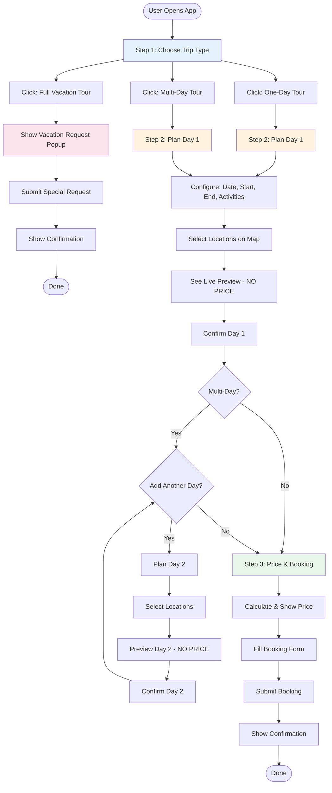
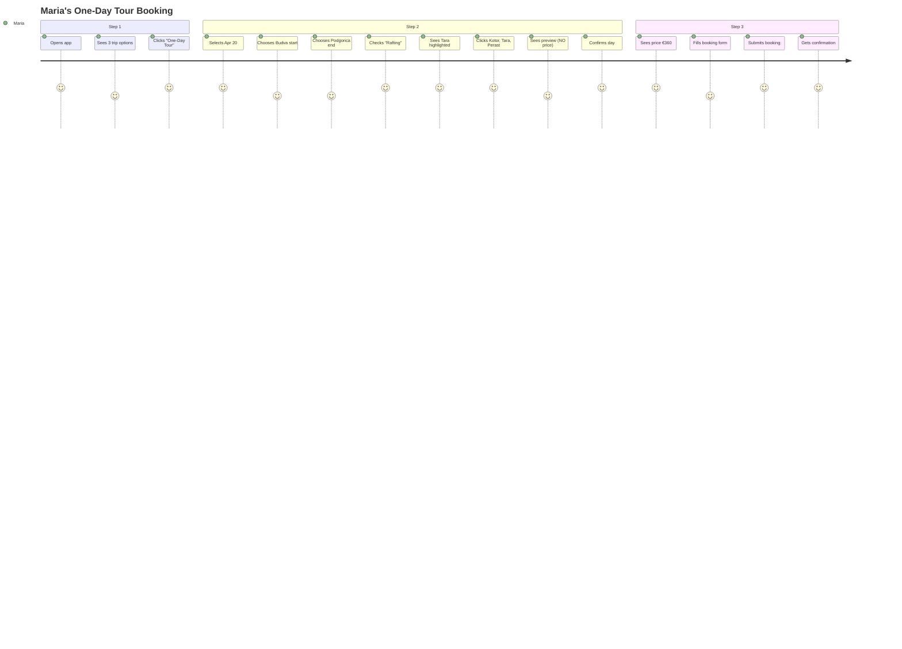
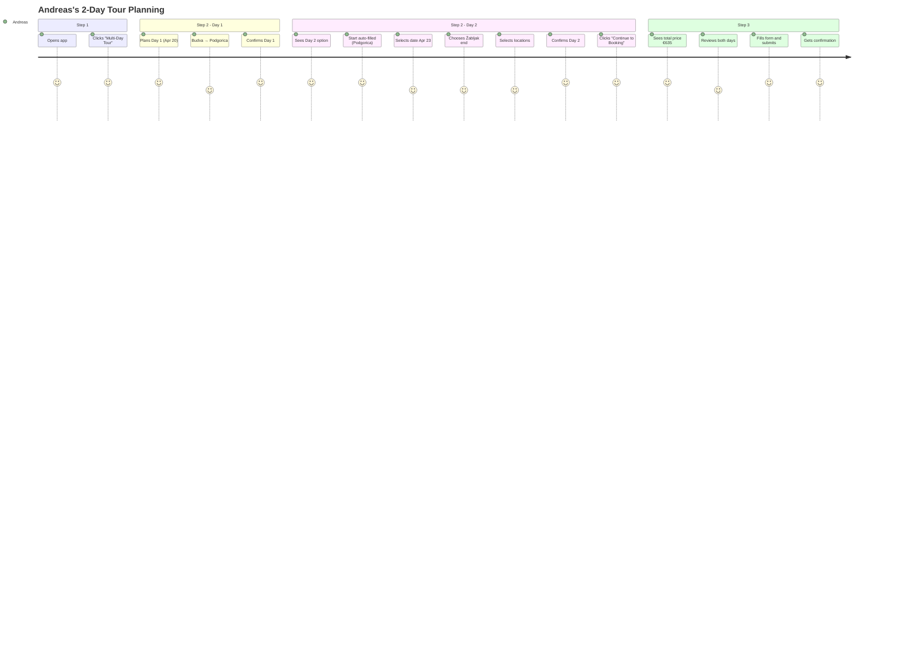
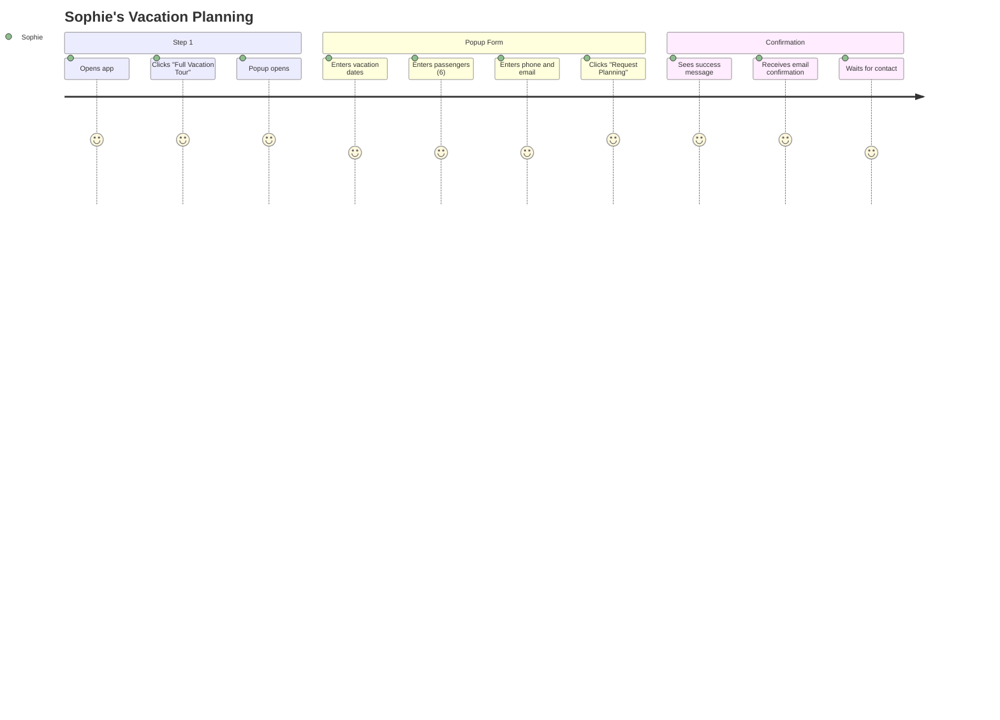

# Montenegro Route Planner — Visual Storyboard

**For Designers** — Wireframes & User Flow Diagrams  
**Date**: April 21, 2026  
**Version**: 1.0

---

## 📱 User Flow Overview



---

## 🖥️ Desktop Wireframes

### Screen 1: Trip Type Selection (Step 1)

```
┏━━━━━━━━━━━━━━━━━━━━━━━━━━━━━━━━━━━━━━━━━━━━━━━━━━━━━━━━━━━━━━━━━━━━━━━━━┓
┃                    MONTENEGRO ROUTE PLANNER                               ┃
┃                          🇲🇪 Your Adventure Starts Here                    ┃
┗━━━━━━━━━━━━━━━━━━━━━━━━━━━━━━━━━━━━━━━━━━━━━━━━━━━━━━━━━━━━━━━━━━━━━━━━━┛

                         Choose Your Trip Type


    ┌──────────────────────┐  ┌──────────────────────┐  ┌──────────────────────┐
    │                      │  │                      │  │                      │
    │    📅 ONE-DAY       │  │   🗓️ MULTI-DAY      │  │   ✨ FULL VACATION  │
    │                      │  │                      │  │                      │
    │   [Day Trip Icon]    │  │  [Journey Icon]      │  │  [Vacation Icon]     │
    │                      │  │                      │  │                      │
    │   Perfect for a      │  │  Explore Montenegro  │  │  Let us plan your    │
    │   quick adventure    │  │  at your own pace    │  │  entire vacation     │
    │                      │  │                      │  │                      │
    │   • Single day       │  │  • Multiple days     │  │  • Personalized      │
    │   • Easy planning    │  │  • Different cities  │  │  • VIP service       │
    │   • Instant booking  │  │  • Flexible dates    │  │  • Full support      │
    │                      │  │                      │  │                      │
    │   [  Select  ]       │  │   [  Select  ]       │  │   [  Select  ]       │
    │                      │  │                      │  │                      │
    └──────────────────────┘  └──────────────────────┘  └──────────────────────┘

                              ← Back to Info
```

**Design Notes**:
- Clean, spacious layout
- 3 equal-width cards (responsive)
- Mediterranean blue primary color
- Icons represent each trip type
- Hover effect on cards (slight elevation)

---

### Screen 1b: Full Vacation Popup (Overlay)

```
┌──────────────────────── MODAL OVERLAY ─────────────────────────┐
│                                                                 │
│   ┏━━━━━━━━━━━━━━━━━━━━━━━━━━━━━━━━━━━━━━━━━━━━━━━━━━━━━━━┓   │
│   ┃  Plan Your Perfect Montenegro Vacation 🇲🇪              ┃   │
│   ┣━━━━━━━━━━━━━━━━━━━━━━━━━━━━━━━━━━━━━━━━━━━━━━━━━━━━━━━┫   │
│   ┃                                              [✕ Close]  ┃   │
│   ┃                                                         ┃   │
│   ┃  [Montenegro landscape image or illustration]          ┃   │
│   ┃                                                         ┃   │
│   ┃  Our team will contact you to create a personalized   ┃   │
│   ┃  itinerary for your entire stay in Montenegro         ┃   │
│   ┃                                                         ┃   │
│   ┃  ┌──────────────────────────────────────────────────┐  ┃   │
│   ┃  │  Vacation Start Date *                          │  ┃   │
│   ┃  │  [ 📅  Jun 1, 2026 ▼ ]                         │  ┃   │
│   ┃  └──────────────────────────────────────────────────┘  ┃   │
│   ┃                                                         ┃   │
│   ┃  ┌──────────────────────────────────────────────────┐  ┃   │
│   ┃  │  Vacation End Date *                            │  ┃   │
│   ┃  │  [ 📅  Jun 14, 2026 ▼ ]                        │  ┃   │
│   ┃  └──────────────────────────────────────────────────┘  ┃   │
│   ┃                                                         ┃   │
│   ┃  ┌──────────────────────────────────────────────────┐  ┃   │
│   ┃  │  Number of Passengers *                         │  ┃   │
│   ┃  │  [ ➖  4  ➕ ]                                   │  ┃   │
│   ┃  └──────────────────────────────────────────────────┘  ┃   │
│   ┃                                                         ┃   │
│   ┃  ┌──────────────────────────────────────────────────┐  ┃   │
│   ┃  │  Phone Number *                                 │  ┃   │
│   ┃  │  [ +49 ▼ ] [ 123 456 789 ]                     │  ┃   │
│   ┃  └──────────────────────────────────────────────────┘  ┃   │
│   ┃                                                         ┃   │
│   ┃  ┌──────────────────────────────────────────────────┐  ┃   │
│   ┃  │  Email Address *                                │  ┃   │
│   ┃  │  [ maria@example.com ]                          │  ┃   │
│   ┃  └──────────────────────────────────────────────────┘  ┃   │
│   ┃                                                         ┃   │
│   ┃       [  Request Vacation Planning  ] (Large CTA)      ┃   │
│   ┃                                                         ┃   │
│   ┃  🔒 Your data is secure and will only be used to      ┃   │
│   ┃     contact you about your vacation planning          ┃   │
│   ┗━━━━━━━━━━━━━━━━━━━━━━━━━━━━━━━━━━━━━━━━━━━━━━━━━━━━━━━┛   │
│                                                                 │
└─────────────────────────────────────────────────────────────────┘
```

**Design Notes**:
- Modal centered on screen
- Warm, inviting colors
- Montenegro imagery (coastal/mountain scenes)
- Clear, simple form
- Trust indicators (secure, privacy)
- Large CTA button

---

### Screen 2: Plan Day 1 (Step 2 - Desktop)

```
┏━━━━━━━━━━━━━━━━━━━━━━━━━━━━━━━━━━━━━━━━━━━━━━━━━━━━━━━━━━━━━━━━━━━━━━━━━━━━━━━━━━━━━┓
┃  Plan Your Trip  →  Step 2: Plan Days  →  Step 3: Booking                             ┃
┗━━━━━━━━━━━━━━━━━━━━━━━━━━━━━━━━━━━━━━━━━━━━━━━━━━━━━━━━━━━━━━━━━━━━━━━━━━━━━━━━━━━━━┛

LEFT PANEL (40%)                           RIGHT PANEL (60%)
┌──────────────────────────────┐         ┌──────────────────────────────────────┐
│ 📋 Planning: Day 1 (Apr 20)  │         │                                       │
├──────────────────────────────┤         │                                       │
│                              │         │        🗺️ INTERACTIVE MAP            │
│ Date for Day 1 📅           │         │                                       │
│ [ April 20, 2026 ▼ ]        │         │   [Montenegro - Centered]             │
│                              │         │                                       │
│ Passengers 👥               │         │   📍 Budva (starting - highlighted)   │
│ [ ➖  4  ➕ ]                │         │   📍 Kotor (selectable)               │
│                              │         │   📍 Perast (selectable)              │
│ Starting Point 📍            │         │   🚣 Tara Canyon (RAFTING badge)     │
│ [ Budva ▼ ]                  │         │   📍 Skadar Lake (selectable)         │
│                              │         │   📍 Ostrog (selectable)              │
│ Ending Point 🏁              │         │   📍 Podgorica (ending - highlighted) │
│ [ Podgorica ▼ ]              │         │                                       │
│                              │         │   Route line: Budva → ... → Podgorica│
│ Activities 🎯                │         │                                       │
│ ☑ Rafting (2 locations)     │         │   [Zoom controls]                     │
│ ☐ Canyoning (1 location)    │         │                                       │
│ ☐ ATV Tours (2 locations)   │         │                                       │
│ ☐ Jeep Tours (2 locations)  │         │                                       │
│ ☐ Zipline (1 location)      │         └──────────────────────────────────────┘
│                              │
│ Selected Locations:          │         ┌──────────────────────────────────────┐
│ ┌──────────────────────────┐ │         │  📋 DAY PREVIEW              [✕]    │
│ │ 🏰 Kotor Old Town  [✕]  │ │         ├──────────────────────────────────────┤
│ │    Visit: 2 hours        │ │         │  Day 1 (April 20)                   │
│ └──────────────────────────┘ │         │  Budva → Podgorica                  │
│ ┌──────────────────────────┐ │         │                                      │
│ │ 🏞️ Perast         [✕]  │ │         │  Route:                             │
│ │    Visit: 1.5 hours      │ │         │  • 9:00 AM - Depart Budva           │
│ └──────────────────────────┘ │         │  • 10:00 AM - Kotor (2h)            │
│ ┌──────────────────────────┐ │         │  • 1:00 PM - Tara Canyon            │
│ │ 🚣 Tara Canyon    [✕]  │ │         │              Rafting (4h)            │
│ │    Rafting: 4 hours      │ │         │  • 6:00 PM - Perast (1.5h)          │
│ │    💧 Available          │ │         │  • 8:30 PM - Arrive Podgorica       │
│ └──────────────────────────┘ │         │                                      │
│                              │         │  Total Duration: 11.5 hours ✅       │
│                              │         │                                      │
│                              │         │  ⚠️ NO PRICE YET                    │
│                              │         │  (Price shown in Step 3)             │
│                              │         │                                      │
│                              │         │  [  Confirm This Day  ]              │
│                              │         │  [  Modify  ] [  Discard  ]          │
│                              │         └──────────────────────────────────────┘
│                              │
│                              │         ┌──────────────────────────────────────┐
│ [  ← Back  ]                 │         │  📅 CONFIRMED DAYS                  │
│                              │         ├──────────────────────────────────────┤
│                              │         │  (Empty - no days confirmed yet)     │
│                              │         │                                      │
│                              │         │  + Add Another Day                   │
│                              │         └──────────────────────────────────────┘
└──────────────────────────────┘
```

**Design Notes**:
- Split screen: 40/60 ratio
- Left: Configuration form (sticky scroll)
- Right: Map (full height) + Floating panels
- Activity checkboxes show location count
- Selected activities highlight map markers
- Live preview updates as user clicks
- No price visible in Step 2

---

### Screen 2b: Multi-Day Summary (After confirming Day 1)

```
LEFT PANEL                                 RIGHT PANEL
┌──────────────────────────────┐         ┌──────────────────────────────────────┐
│ 📋 Planning: Day 2 (Apr 23)  │         │        🗺️ INTERACTIVE MAP            │
├──────────────────────────────┤         │                                       │
│ (Same form as Day 1)         │         │  Color-coded markers:                 │
│                              │         │  🔵 Day 1 locations (blue)            │
│ Date for Day 2 📅           │         │  🟢 Day 2 locations (green)           │
│ [ April 23, 2026 ▼ ]        │         │                                       │
│                              │         └──────────────────────────────────────┘
│ Starting Point 📍            │
│ [ Podgorica ] (auto-filled)  │         ┌──────────────────────────────────────┐
│ 🔒 (From Day 1 ending)       │         │  📅 CONFIRMED DAYS                  │
│                              │         ├──────────────────────────────────────┤
│ Ending Point 🏁              │         │  ┌────────────────────────────────┐ │
│ [ Žabljak ▼ ]                │         │  │ Day 1 (Apr 20)                 │ │
│                              │         │  │ Budva → Podgorica              │ │
│ ...                          │         │  │ • Kotor, Perast, Tara Rafting  │ │
└──────────────────────────────┘         │  │ • Duration: 11.5h              │ │
                                         │  │                  [Edit]  [✕]   │ │
                                         │  └────────────────────────────────┘ │
                                         │                                      │
                                         │  + Add Day 3                         │
                                         │                                      │
                                         │  [  Continue to Booking  ]  (CTA)    │
                                         └──────────────────────────────────────┘
```

**Design Notes**:
- Day 2 start point auto-filled from Day 1 end
- Confirmed days shown in collapsible cards
- Can edit or delete confirmed days
- Map shows multiple days with color coding
- "Continue to Booking" appears when ≥1 day confirmed

---

### Screen 3: Price & Booking (Step 3 - Desktop)

```
┏━━━━━━━━━━━━━━━━━━━━━━━━━━━━━━━━━━━━━━━━━━━━━━━━━━━━━━━━━━━━━━━━━━━━━━━━━━━━━━━━━━━━━┓
┃  Plan Your Trip  →  Step 2: Plan Days  →  Step 3: Booking  ✅                         ┃
┗━━━━━━━━━━━━━━━━━━━━━━━━━━━━━━━━━━━━━━━━━━━━━━━━━━━━━━━━━━━━━━━━━━━━━━━━━━━━━━━━━━━━━┛

LEFT PANEL (50%)                           RIGHT PANEL (50%)
┌──────────────────────────────────────┐ ┌──────────────────────────────────────┐
│  📋 YOUR TRIP SUMMARY                │ │  💰 PRICE BREAKDOWN                  │
├──────────────────────────────────────┤ ├──────────────────────────────────────┤
│                                      │ │                                      │
│  ┌────────────────────────────────┐  │ │  Day 1 (April 20)                   │
│  │ Day 1 (April 20)               │  │ │  Base price ............... €100    │
│  │ Budva → Podgorica       [Edit] │  │ │  Distance (120 km) ........ €120    │
│  │                                │  │ │  4 passengers ............. €80     │
│  │ Route:                         │  │ │  Rafting activity ......... €60     │
│  │ • Kotor Old Town (2h)          │  │ │  ────────────────────────────        │
│  │ • Rafting at Tara (4h)         │  │ │  Day 1 Total .............. €360    │
│  │ • Perast (1.5h)                │  │ │                                      │
│  │                                │  │ │  Day 2 (April 23)                   │
│  │ Duration: 11.5 hours           │  │ │  Base price ............... €100    │
│  │ Price: €360                    │  │ │  Distance (95 km) ......... €95     │
│  └────────────────────────────────┘  │ │  4 passengers ............. €80     │
│                                      │ │  ────────────────────────────        │
│  ┌────────────────────────────────┐  │ │  Day 2 Total .............. €275    │
│  │ Day 2 (April 23)               │  │ │                                      │
│  │ Podgorica → Žabljak     [Edit] │  │ │  ════════════════════════════        │
│  │                                │  │ │  TOTAL PRICE .............. €635    │
│  │ Route:                         │  │ │                                      │
│  │ • Skadar Lake (2h)             │  │ │  💳 Payment at pickup               │
│  │ • Ostrog Monastery (3h)        │  │ │                                      │
│  │                                │  │ └──────────────────────────────────────┘
│  │ Duration: 9 hours              │  │
│  │ Price: €275                    │  │ ┌──────────────────────────────────────┐
│  └────────────────────────────────┘  │ │  📝 BOOKING INFORMATION              │
│                                      │ ├──────────────────────────────────────┤
│  ────────────────────────────────    │ │                                      │
│  Total: 2 days                       │ │  Full Name *                        │
│  4 passengers                        │ │  [ Maria Schmidt ]                   │
│  Total Price: €635                   │ │                                      │
│                                      │ │  Email Address *                    │
│  [  ← Edit Days  ]                   │ │  [ maria@example.com ]               │
│                                      │ │                                      │
└──────────────────────────────────────┘ │  Phone Number *                     │
                                         │  [ +49 123 456 789 ]                 │
                                         │                                      │
                                         │  Additional Notes (Optional)        │
                                         │  ┌────────────────────────────────┐  │
                                         │  │ Prefer morning departure       │  │
                                         │  │                                │  │
                                         │  └────────────────────────────────┘  │
                                         │                                      │
                                         │  ☑ I accept the terms and conditions│
                                         │                                      │
                                         │  [  Submit Booking Request  ]  (CTA) │
                                         │                                      │
                                         └──────────────────────────────────────┘
```

**Design Notes**:
- Left: Trip summary (all days, now with prices!)
- Right: Price breakdown + Booking form
- Clear, itemized pricing
- Total price prominent
- Simple booking form
- Can go back to edit days

---

## 📱 Mobile Wireframes

### Mobile Screen 1: Trip Type Selection

```
┏━━━━━━━━━━━━━━━━━━━━━━┓
┃                      ┃
┃  MONTENEGRO ROUTE    ┃
┃      PLANNER         ┃
┃        🇲🇪            ┃
┃                      ┃
┃  Choose Trip Type    ┃
┃ ─────────────────── ┃
┃                      ┃
┃ ┌──────────────────┐ ┃
┃ │                  │ ┃
┃ │  📅 ONE-DAY     │ ┃
┃ │                  │ ┃
┃ │  Quick adventure │ ┃
┃ │  • Single day    │ ┃
┃ │  • Easy planning │ ┃
┃ │                  │ ┃
┃ │   [  Select  ]   │ ┃
┃ └──────────────────┘ ┃
┃                      ┃
┃ ┌──────────────────┐ ┃
┃ │                  │ ┃
┃ │  🗓️ MULTI-DAY   │ ┃
┃ │                  │ ┃
┃ │  Explore at pace │ ┃
┃ │  • Multiple days │ ┃
┃ │  • Flex routing  │ ┃
┃ │                  │ ┃
┃ │   [  Select  ]   │ ┃
┃ └──────────────────┘ ┃
┃                      ┃
┃ ┌──────────────────┐ ┃
┃ │                  │ ┃
┃ │  ✨ VACATION    │ ┃
┃ │                  │ ┃
┃ │  We plan it all  │ ┃
┃ │  • Personalized  │ ┃
┃ │  • VIP service   │ ┃
┃ │                  │ ┃
┃ │   [  Select  ]   │ ┃
┃ └──────────────────┘ ┃
┃                      ┃
┗━━━━━━━━━━━━━━━━━━━━━━┛
```

---

### Mobile Screen 2: Plan Day (Stacked Layout)

```
┏━━━━━━━━━━━━━━━━━━━━━━┓
┃  ← Step 2: Plan Days ┃
┣━━━━━━━━━━━━━━━━━━━━━━┫
┃                      ┃
┃ 📋 Day 1 (Apr 20)    ┃
┃                      ┃
┃ Date 📅              ┃
┃ [ Apr 20, 2026 ▼ ]  ┃
┃                      ┃
┃ Passengers 👥        ┃
┃ [ ➖  4  ➕ ]        ┃
┃                      ┃
┃ Start 📍             ┃
┃ [ Budva ▼ ]          ┃
┃                      ┃
┃ End 🏁               ┃
┃ [ Podgorica ▼ ]      ┃
┃                      ┃
┃ Activities 🎯        ┃
┃ ☑ Rafting (2)        ┃
┃ ☐ Canyoning (1)      ┃
┃ ☐ ATV Tours (2)      ┃
┃                      ┃
┃ Selected Locations:  ┃
┃ ┌──────────────────┐ ┃
┃ │ 🏰 Kotor    [✕] │ ┃
┃ │    Visit: 2h     │ ┃
┃ └──────────────────┘ ┃
┃ ┌──────────────────┐ ┃
┃ │ 🚣 Tara     [✕] │ ┃
┃ │    Rafting: 4h   │ ┃
┃ └──────────────────┘ ┃
┃                      ┃
┃ [ View Map ]  (Tab)  ┃
┃                      ┃
┣━━━━━━━━━━━━━━━━━━━━━━┫
┃  PREVIEW             ┃
┃  Day 1 (Apr 20)      ┃
┃  Duration: 11.5h ✅  ┃
┃  ⚠️ NO PRICE YET     ┃
┃                      ┃
┃  [ Confirm Day ]     ┃
┗━━━━━━━━━━━━━━━━━━━━━━┛
```

---

### Mobile Screen 2b: Map View (Tab)

```
┏━━━━━━━━━━━━━━━━━━━━━━┓
┃  ← Day 1             ┃
┣━━━━━━━━━━━━━━━━━━━━━━┫
┃ [ Form ] [ Map ]  ← ┃
┣━━━━━━━━━━━━━━━━━━━━━━┫
┃                      ┃
┃                      ┃
┃    🗺️                ┃
┃                      ┃
┃  INTERACTIVE MAP     ┃
┃                      ┃
┃  📍 Budva (start)    ┃
┃  📍 Kotor            ┃
┃  🚣 Tara (Rafting)   ┃
┃  📍 Podgorica (end)  ┃
┃                      ┃
┃  [Zoom controls]     ┃
┃                      ┃
┃                      ┃
┃                      ┃
┣━━━━━━━━━━━━━━━━━━━━━━┫
┃  Duration: 11.5h ✅  ┃
┃  [ Confirm Day ]     ┃
┗━━━━━━━━━━━━━━━━━━━━━━┛
```

---

### Mobile Screen 3: Price & Booking

```
┏━━━━━━━━━━━━━━━━━━━━━━┓
┃  ← Step 3: Booking   ┃
┣━━━━━━━━━━━━━━━━━━━━━━┫
┃                      ┃
┃ 📋 YOUR TRIP         ┃
┃ ─────────────────── ┃
┃ ┌──────────────────┐ ┃
┃ │ Day 1 (Apr 20)   │ ┃
┃ │ Budva→Podgorica  │ ┃
┃ │ 11.5h | €360  ▼  │ ┃
┃ └──────────────────┘ ┃
┃ ┌──────────────────┐ ┃
┃ │ Day 2 (Apr 23)   │ ┃  
┃ │ Podgorica→Žabljak│ ┃
┃ │ 9h | €275     ▼  │ ┃
┃ └──────────────────┘ ┃
┃                      ┃
┃ 💰 TOTAL: €635       ┃
┃ ═══════════════════  ┃
┃                      ┃
┃ 📝 BOOKING FORM      ┃
┃ ─────────────────── ┃
┃                      ┃
┃ Full Name            ┃
┃ [ Maria Schmidt ]    ┃
┃                      ┃
┃ Email                ┃
┃ [ maria@example.com ]┃
┃                      ┃
┃ Phone                ┃
┃ [ +49 123 456 789 ]  ┃
┃                      ┃
┃ Notes (Optional)     ┃
┃ ┌──────────────────┐ ┃
┃ │                  │ ┃
┃ └──────────────────┘ ┃
┃                      ┃
┃ ☑ I accept terms     ┃
┃                      ┃
┃ [Submit Booking] CTA ┃
┃                      ┃
┗━━━━━━━━━━━━━━━━━━━━━━┛
```

---

## 🎨 Component Interactions

### Activity Selection → Map Highlighting

```
USER ACTION:                          MAP RESPONSE:
                                      
☑ Rafting (checked)          →       🚣 Tara Canyon: HIGHLIGHTED
                                      📍 Other locations: normal
                                      
                                      Visual: Glow/badge on markers
```

### Day Selection → Color Coding

```
CONFIRMED DAYS:                       MAP DISPLAY:

Day 1 (Apr 20)               →        🔵 Budva, Kotor, Perast (blue)
Budva → Podgorica                     Blue route line

Day 2 (Apr 23)               →        🟢 Skadar, Ostrog, Žabljak (green)
Podgorica → Žabljak                   Green route line
```

### Price Visibility Flow

```
STEP 1:                               STEP 2:                    STEP 3:

Choose Trip Type                      Plan Days                  Price & Booking
                                      
NO PRICE                      →       NO PRICE               →   ✅ PRICE SHOWN
                                      "See price in Step 3"      Per day + Total
```

---

## 🎭 User Journey Examples

### Journey 1: Quick One-Day Tour



### Journey 2: Multi-Day Tour



### Journey 3: Full Vacation Request



---

## 📐 Responsive Breakpoints

### Desktop (> 1024px)
- Split-screen layout
- Map always visible
- Side-by-side panels

### Tablet (768px - 1024px)
- Stacked layout
- Map collapsible
- Reduced spacing

### Mobile (< 768px)
- Single column
- Tabbed interface (Form / Map)
- Sticky CTAs at bottom
- Simplified cards

---

## 🎨 Design System Quick Reference

### Colors
- **Primary**: Mediterranean Blue (#1E40AF)
- **Secondary**: Coastal Teal (#0D9488)
- **Accent**: Warm Coral (#F97316)
- **Success**: Green (#10B981)
- **Warning**: Amber (#F59E0B)

### Typography
- **Headings**: Semibold, large
- **Body**: Regular, 14-16px
- **Labels**: Medium, 12-14px

### Spacing
- **Component padding**: 16-24px
- **Section gaps**: 24-32px
- **Form fields**: 12-16px gap

### Border Radius
- **Cards**: 8-12px
- **Buttons**: 6-8px
- **Inputs**: 6px

---

## 📝 Notes for Designers

### Priority Elements
1. **Trip Type Cards** → Eye-catching, clear value prop
2. **Map Integration** → Smooth, interactive, with activity badges
3. **Preview Panel** → Real-time updates, clear timeline
4. **Price Display** → Only in Step 3, prominent total
5. **Full Vacation Popup** → Premium feel, trust signals

### Mobile Considerations
- Touch-friendly tap targets (min 44px)
- Simplified map controls
- Sticky CTA at bottom
- Easy thumb reach for key actions
- Tabbed interface for form/map

### Accessibility
- High contrast ratios
- ARIA labels for screen readers
- Keyboard navigation support
- Focus states visible
- Error messages clear

---

**END OF VISUAL STORYBOARD**

**Next Steps**:
1. Use these wireframes as basis for high-fidelity designs
2. Create design mockups in Figma/Sketch/Adobe XD
3. Test prototypes with users
4. Iterate based on feedback

**Tools Suggested**:
- Figma (collaborative design)
- Adobe XD (UX/UI design)
- InVision (prototyping)
- Miro (user flow mapping)
